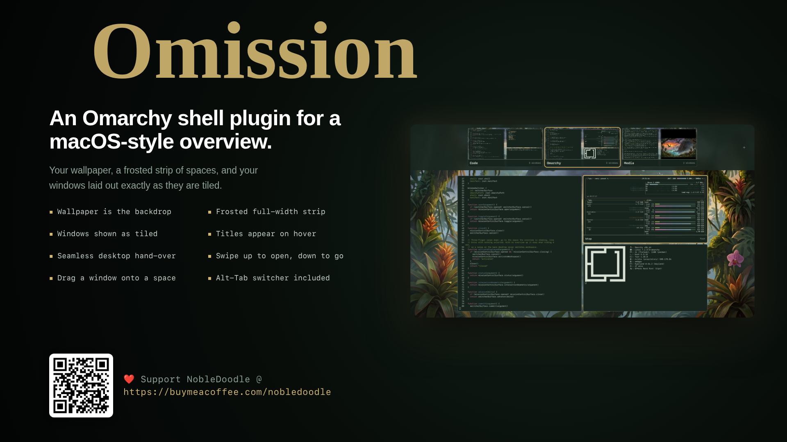

# Omission



A macOS-style overview for [Omarchy](https://omarchy.org). Open it and your desktop becomes your own wallpaper, a frosted strip of spaces along the top, and the windows of the current space laid out exactly as they are tiled. Hover a window to see its title; click one to go to it. It runs inside the existing `omarchy-shell` process as a third-party plugin: no separate daemon, privileged installer, or Hyprland plugin to compile.

Omission is a redesigned fork of [Mission Control](https://github.com/rmacy/omarchy-mission-control) by Ryan Macy (MIT), whose window model, space management, bar widget, and Alt-Tab switcher it builds on. See [What is different from Mission Control](#what-is-different-from-mission-control) and [Credits](#credits).

## Features

- **Your wallpaper is the backdrop.** Nothing of the desktop or the bar shows through.
- **A full-width frosted strip of spaces** over a blurred copy of the wallpaper, in your theme's background color, with each space drawn as a small picture of that desktop.
- **Windows drawn as they are tiled.** The selected space appears at its real layout, scaled to fit: every window bare, at its real position and size, with Hyprland's rounding. A tall terminal stays tall; a floating window stays where you put it.
- **Titles on hover.** A window's title appears in the same bar the space cards use, on hover or when you select it with the keyboard.
- **A hand-over, not a fade.** Opening keeps the overlay invisible until every window has a capture and the wallpaper has decoded, then stands each card exactly on its window (wearing Hyprland's own border) and shrinks it into place. Closing reverses it. The whole motion takes about 190 ms in and 130 ms out.
- **Outlines that match your windows.** The focused space and the selected window wear Hyprland's own active-window border: its `border_size`, every color stop and the angle of a gradient `col.active_border`, and corners on the same `rounding` / `rounding_power` curve, laid out with Hyprland's own gradient and corner formulas. Unfocused space cards use its inactive border color. All of it is read from Hyprland, so it follows theme switches.
- **Previews on a 30 fps beat** instead of running live, which keeps the overlay from redrawing the whole screen every frame.
- **Space management.** Drag to reorder, create, remove, and rename spaces; drag a window onto a space card to send it there.
- **A bar spaces widget** that shows exactly the spaces that exist, in one of four styles (numbers, dots, pills, or lines) or hidden, chosen from a settings panel in the overview, plus a **themed Alt-Tab switcher** for the active workspace, ordered by Hyprland focus history.
- Uses Omarchy's active colors, typography, and application icons, and restores your normal Hyprland configuration when disabled or removed.

## What is different from Mission Control

- The window grid is gone. The selected space is drawn at its real tiled layout instead, and arrow keys move between windows by position.
- The backdrop is your wallpaper rather than a dimmed copy of the desktop, and the strip is full width and frosted.
- Opening and closing are a hand-over from and back to the real windows, about 20% faster than Mission Control's motion.
- Three-finger swipe **down** goes to the space the overview is showing, like `Enter`, instead of just closing.
- The overview follows the desktop's workspace: if it changes while the overview is open (for example with your own three-finger sideways swipe binding), the overview shows the new space.
- Five upstream bugs are fixed: the wallpaper missing from the space cards on Omarchy 4.0.4, a white flash when closing, a Hyprland crash from the Alt-Tab script calling methods on expired keybind handles, window activation being undone when the overlay closed, and generic icons in Alt-Tab and the overview (a plugin without the `menu` kind never receives the shell's app library, so desktop entries are now read directly).
- It has its own identity (`io.github.nobledoodle.omission`), IPC targets, layer namespaces, and state files, so it never shares state with Mission Control.

## Requirements

- Omarchy 4.0 or newer (developed and tested on 4.0.4)
- Hyprland 0.56 or newer with Lua configuration (tested with 0.56.2), including the `hyprctl` client that ships with Hyprland
- Quickshell 0.3 or newer (Omarchy's `omarchy-shell` host process; tested with 0.3.1)
- Hyprland support for `hyprland-toplevel-export-v1` and foreign-toplevel management; both are present in stock Omarchy
- Qt Multimedia (`qt6-multimedia`) for shared video wallpaper frames, and Qt Quick Effects (part of `qt6-declarative`) for the blurred strip; both ship with Omarchy
- Bash and coreutils `realpath`, used by the bundled `bin/background-source` wallpaper helper
- A POSIX `sh`, used only by the serialized teardown command chain
- `notify-send`, used only on the binding-registration failure path

No build step, downloaded artifact, native binary, Node package, Python package, or runtime setup is required. Every dependency above ships with a stock Omarchy installation.

## Install

```bash
omarchy plugin add https://github.com/NobleDoodle/omission --enable
```

Omarchy clones the repository into `~/.config/omarchy/plugins/io.github.nobledoodle.omission/`, validates `manifest.json`, and enables it. The plugin ships no install hooks, requires no elevated privileges, and never edits shell configuration itself. When you explicitly enable it, Omarchy records the plugin and optional bar-widget placement in your shell configuration. This single install delivers the overview, the bar spaces widget, and the Alt-Tab switcher.

Omarchy adds plugins *disabled* unless you pass `--enable`, so you can also leave the flag off, read the code first, then run `omarchy plugin enable io.github.nobledoodle.omission`.

The single overlay entry point, `Overlay.qml`, hosts both surfaces. They are mutually exclusive: opening the overview dismisses the Alt-Tab switcher, and starting an Alt-Tab switch closes the overview.

## Use: the overview

Open the overview with:

- `Control + Up`
- Three-finger swipe up

Go to the space it is showing with a three-finger swipe **down**. `Control + Down`, `Escape`, or `Q` close it and return you to the space you opened it from.

| Input | Action |
|---|---|
| Mouse hover, arrow keys, **H/J/K/L** | Select a window (the arrow keys move by position in the layout) |
| Click or `Enter` | Focus the selected window |
| Click a space | Preview that space |
| Double-click a space | Switch to that space |
| Drag a space | Reorder spaces; Hyprland IDs are renumbered to match |
| Space `+` button | Create and switch to a persistent space |
| Space `×` button | Remove a space and move its windows to its neighbor |
| Space `Edit` button | Edit the space name inline; `Enter` saves and `Escape` cancels |
| `Control + Left` / `Control + Right` | Preview the adjacent space while the overview stays open |
| `Shift + Left` / `Shift + Right` | Reorder the selected space |
| Drag a window onto a space card | Move only that window to the space; the view and focus stay put |
| `Shift + 1` through `Shift + 9` | Move the selected window to that space |
| `1` through `9` | Preview that numbered space when present |
| `Tab` / `Shift + Tab` | Select next / previous window |
| Window close button | Ask the application to close that window |
| Gear at the top left, or `S` | Open the bar settings panel (below) |

The plugin registers its shortcuts and gestures at runtime. If any of them replaced one of yours, disabling or removing the plugin reloads Hyprland so your own mapping returns.

**Sideways swipes.** Omission does not bind three-finger *sideways* swipes itself. If your own Hyprland config switches workspaces with them, the overview follows the desktop: it shows whichever space becomes active while it is open, and a swipe down then stays there.

**Closing returns you to where you opened it.** `Escape`, `Q`, and `Control + Down` restore the window that was focused when the overview opened, which is Hyprland's behavior when a layer surface closes. Use a swipe down, `Enter`, or a double-click to go somewhere else.

Omission remembers managed spaces in `~/.local/state/omarchy/omission-spaces.json` and custom names in `~/.local/state/omarchy/omission-space-names.json`. Names follow their space when positions are reordered and appear in the dynamic Omarchy bar. It supports spaces 1 through 10, matching Omarchy's workspace conventions. Removing the final remaining space is disabled.

### Desktop thumbnails and wallpapers

Each space card composes Hyprland's real window geometry with captured client surfaces, so tiled and floating windows appear where they actually live. Space cards take a snapshot when the overview opens, and the selected space's windows refresh on a shared 30 fps beat. At most 12 windows of the selected space are captured.

Wayland's toplevel export omits compositor-only decorations and layer-shell surfaces, so the cards include wallpaper, window placement, sizes, and content, but not the Omarchy bar, shadows, or notification layers.

Static wallpaper paths come from Omarchy's current-background state link. When `mpvpaper` is active, the plugin reads its local `/proc` command line, selects the process targeting the overview monitor (or `*`), and uses that existing local video file for the space cards through one shared, muted, looping Qt Multimedia decoder. With a video wallpaper the overview's backdrop is a plain theme-colored ground and it fades in instead of handing over, since there is no still image to stand the windows on. Remote, relative, missing, and non-regular wallpaper paths are rejected. No frame is downloaded, transcoded, or written to disk.

## Bar widget

The plugin also ships a bar widget, `Omission Spaces`. Instead of always painting workspaces 1-5, it renders the union of the overview's saved spaces and the workspaces Hyprland currently has (up to space 10), so the bar grows and shrinks with the overview. Occupied and focused spaces keep the stock styling, vertical bars are supported, and clicking a space focuses it.

The plugin service is the single owner of `~/.local/state/omarchy/omission-spaces.json`. The overview and every bar instance bind directly to that service's normalized ID array, so create, remove, or reorder updates are synchronous and cannot diverge across independent file watchers.

### Placing the widget

The plugin never edits `~/.config/omarchy/shell.json` or `bar.layout` itself. Bar-widget placement is explicit and user-controlled, and it is performed by Omarchy's own plugin commands:

```bash
omarchy plugin enable io.github.nobledoodle.omission --section left --after omarchy.workspaces
```

`--section` accepts `left`, `center`, or `right`, and the position can be pinned with `--index N`, `--before <widget-id>`, or `--after <widget-id>`. Equivalent shell IPC calls also exist:

```bash
omarchy-shell shell putBarWidget io.github.nobledoodle.omission '{"section":"left"}'
omarchy-shell shell moveBarWidget io.github.nobledoodle.omission '{"section":"right"}'
```

The widget and the stock Workspaces indicator can coexist. To let this widget take the stock slot, run `omarchy plugin disable omarchy.workspaces`; to restore the stock one, `omarchy plugin enable omarchy.workspaces --section left`. Removing the plugin only drops its own widget.

### Styles and hiding

Open the overview and click the gear at the top left of the strip, or press `S`. The panel sets, for every bar at once:

- **Show on the bar.** Turn it off to hide the indicator; the overview and the Alt-Tab switcher keep running. The hidden widget takes no space on the bar.
- **Style.** Each tile previews its style with your theme's colors:
  - **Numbers**: the original look, numbers with the focused space as a glyph, custom names in place of numbers.
  - **Dots**: 8 px dots; the focused space grows into a 16 px accent pill over 90 ms. This is the design of [Workspace Dots](https://github.com/voyagen/oma-dots) by Voyagen.
  - **Pills**: numbers (or names) in rounded badges; the focused badge is filled with the accent color, empty spaces are outlined.
  - **Lines**: short bars; the focused one is longer and accent colored, empty spaces fainter.

With the panel open, `1` to `4` or the arrow keys pick a style, `Space` or `Enter` shows or hides the indicator, and `S`, `Q`, or `Escape` close the panel. A click outside the panel closes it too. Dots and lines show custom names as tooltips.

The choice is saved by the plugin service in `~/.local/state/omarchy/omission-settings.json` (`{"barStyle": "dots", "showBarSpaces": true}`) and applied to every bar immediately. It can also be set from a script:

```bash
omarchy-shell io.github.nobledoodle.omission-state barStyle lines
omarchy-shell io.github.nobledoodle.omission-state showBarSpaces false
```

## Use: the Alt-Tab switcher

The switcher is bound to the two chords it intentionally replaces:

- `Alt+Tab`: open the switcher and select the next window
- `Alt+Shift+Tab`: open the switcher and select the previous window

| Input | Action |
| --- | --- |
| `Tab` / `Right` | Advance to the next window |
| `Shift + Tab` / `Left` | Move backward |
| `Enter` | Focus and raise the selection |
| `Escape` | Cancel |
| Release `Alt` | Focus and raise the selection |
| Click a card | Focus and raise that window |

With many windows it shows the full themed, translucent card panel with live window previews; with one, a compact card; with none, a compact zero state (releasing `Alt` then changes nothing).

Only the **active workspace on the focused monitor** is included; hidden, unmapped, non-input, other-workspace, and other-monitor clients are excluded. At most 256 candidates are presented, ordered by Hyprland focus history, and the selected client is revalidated by its stable ID before focus, so a window that dies mid-switch is skipped. Client-controlled titles are rendered as plain text, and class-based fallback icons accept theme-icon identifiers only. Client shortcut inhibitors are respected, so Alt-Tab stays inside a VM, remote desktop, or game while it owns shortcuts.

## Capability disclosure

Omarchy shell plugins are unsandboxed. This plugin loads a persistent `service`, a single `overlay` (which hosts both the overview and the Alt-Tab switcher), and a `bar-widget` inside `omarchy-shell`.

The service:

- Owns `~/.local/state/omarchy/omission-spaces.json`, `~/.local/state/omarchy/omission-space-names.json`, and `~/.local/state/omarchy/omission-settings.json`, and renumbers Hyprland workspace IDs to match managed spaces. It never writes to `~/.config/omarchy/shell.json` or `bar.layout`; bar-widget placement happens only through Omarchy's own plugin commands when you run them.
- Registers the `Control+Up` and `Control+Down` shortcuts and the three-finger swipe-up and swipe-down gestures at runtime through `hyprctl eval`. The bindings run fixed `omarchy-shell -q shell …` command lines through Hyprland's `exec_cmd`. This replaces any three-finger vertical gestures you configured, until the plugin is disabled.
- Registers one Hyprland layer rule (`hl.layer_rule`) that turns off Hyprland's fade for the overview's own layer namespace, `omission`, so the hand-over is not washed out by a second animation.
- Intentionally replaces the configured `Alt+Tab` and `Alt+Shift+Tab` chords while enabled, with owner-guarded Hyprland Lua callbacks and a temporary switcher submap, bounded Alt-state polling, and coalesced navigation.
- Invokes fixed `omarchy-shell` IPC methods on `io.github.nobledoodle.omission`: `advance`, `commit`, and `cancel` (Alt-Tab), and `activateDisplayed` (the swipe-down gesture).
- Tears down through one serialized `sh -c` chain (Alt-Tab cleanup, then host cleanup, then exactly one final `hyprctl reload` that restores configured bindings), with no fixed sleep and no independent second cleanup process.
- Uses `notify-send` only if binding registration fails after bounded retries.

The overlay reads Quickshell's native Hyprland toplevel model and drives workspace renumbering and window moves with `hyprctl eval`. After you activate a window or space it sends a fixed `hl.dsp.focus(...)` expression, built only from a validated hexadecimal stable ID or a workspace number, over Hyprland's IPC socket through Quickshell's own `Hyprland.dispatch`, once Hyprland reports the overlay's layer closed. On startup and after a config reload it runs one read-only `hyprctl --batch` to read `general:border_size`, `general:col.active_border`, `general:col.inactive_border`, `decoration:rounding`, and `decoration:rounding_power` for the outlines and corners. For desktop thumbnails it executes the bundled `bin/background-source` helper, a read-only Bash script that inspects local process metadata under `/proc` and the Omarchy current-background state link and canonicalizes wallpaper candidates with coreutils `realpath`. It also loads the current wallpaper image file. Neither the overlay nor the helper performs network requests, privileged commands, package installation, or filesystem writes.

The bar widget renders from the same in-process service and writes nothing. Clicking a space sends one `hl.dsp.focus(...)` expression, built only from a workspace number from 1 to 10, through Quickshell's `Hyprland.dispatch`; no shell is involved.

Runtime commands, exactly as shipped: `hyprctl` (`eval`, `reload`, and one read-only `--batch` of `getoption` calls); `omarchy-shell` (invoked by the registered Hyprland bindings and by the generated Alt-Tab Lua); the bundled `bin/background-source` script (Bash through `/usr/bin/env`, using coreutils `realpath`); `sh -c` (the serialized teardown chain only); and optional failure-path `notify-send`. All of them ship with a stock Omarchy installation, and none requires root privileges, downloads, or network access. Every one is launched with `PATH` pinned to the root-owned `/usr/local/bin:/usr/bin:/bin`, so a directory earlier in the `PATH` the shell inherited cannot stand in for any of them.

## Limits

- Developed and tested on one 1920x1080 laptop display at scale 1. Fractional scaling and multi-monitor setups have not been exercised beyond what the code path allows.
- The overview targets the monitor that was focused when it opened.
- Scrolling layouts, where windows can sit off-screen, have not been tried.
- Closing with `Escape`, `Q`, or `Control + Down` returns you to the space you opened from (see above).

## Recovery

If a compositor or shell crash interrupts a switch or leaves the temporary submap engaged:

```bash
hyprctl dispatch 'hl.dsp.submap("reset")'
hyprctl reload
omarchy restart shell
```

Inspect configuration errors with `hyprctl configerrors`.

## Update or remove

```bash
omarchy plugin update io.github.nobledoodle.omission
omarchy plugin remove io.github.nobledoodle.omission
```

Updating replaces the whole plugin: overview, bar widget, and Alt-Tab switcher together. Disabling or removing reloads Hyprland, so your configured `Control+Up` mapping, the swipe gestures, and the original `Alt+Tab` and `Alt+Shift+Tab` chords all return. Omarchy removes this plugin's bar-widget entry while leaving every other widget and layout entry untouched. The two state files under `~/.local/state/omarchy/` remain so a reinstall preserves spaces and names; remove them yourself only if you want to discard that state.

## Development and verification

Repository tasks use [mise](https://mise.jdx.dev/):

```bash
mise run check
```

`check` is fully noninteractive: the model and generated-Lua tests, the QML security tests, strict QML diagnostics, an isolated invisible Quickshell construction smoke, manifest validation, and coverage gates (at least 90% line, branch, and function coverage on the executable model logic). It never changes the active desktop.

The suites under `tests/live/` are inherited from Mission Control 4.0.0 and **inject real key and pointer events into your running session**, so they need explicit opt-in and must not be run while you use the desktop. The Alt-Tab smoke is unchanged. The overview's visual suite predates Omission's redesign and has not been re-run against it, so treat it as a starting point rather than a guarantee.

```bash
WINDOW_SWITCHER_LIVE_TEST=1 mise run test-live
OMISSION_VISUAL_ALLOW_ACTIVE_SESSION=1 mise run visual-test   # inherited; not re-verified
```

Install a local checkout through the same plugin path used in production:

```bash
omarchy plugin add "file://$PWD" --enable --yes
```

Live window pixels are provided directly by Hyprland's capture protocol to Quickshell. The plugin does not save previews to disk or send them over the network.

## Credits

Omission is derived from [Mission Control](https://github.com/rmacy/omarchy-mission-control) by Ryan Macy (MIT), taken at commit `cca9ad6`. The window model, space management, bar widget, wallpaper helper, and Alt-Tab switcher are his work, and the fixes listed above were found while building on it. Thank you.

The bar's Dots style follows [Workspace Dots](https://github.com/voyagen/oma-dots) by Voyagen (MIT): its dot and pill sizes, spacing, and 90 ms motion.

## License

[MIT](LICENSE). Copyright © 2026 NobleDoodle, © 2026 Ryan Macy for the code this derives from, and © 2026 Voyagen for the Dots style.
